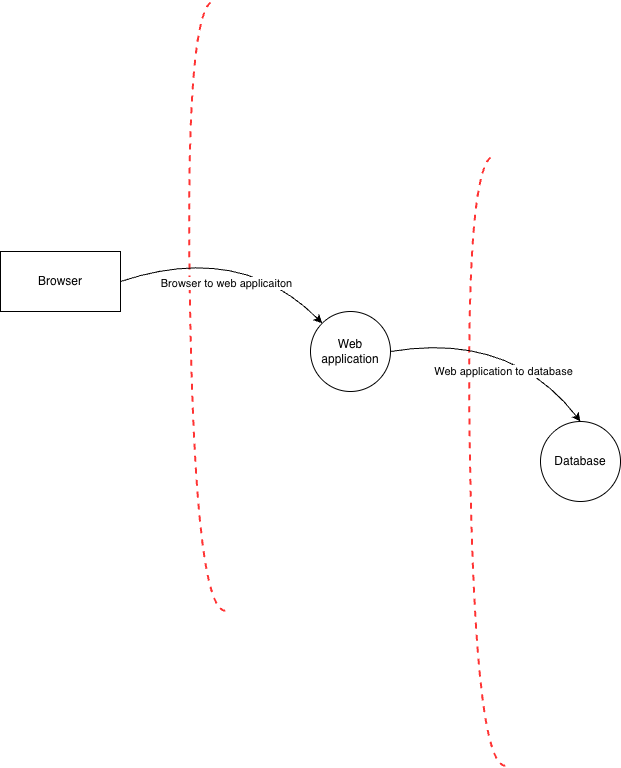

# Web-Based Secure Password Manager

In scopre for the project:

* User registration and login with a master password
* Per user password vault
* Server side encryption for the secrets
* Session management
* Audit log
* HTTPS

Out of scope for the project:

* Password sharing between the users
* Password reset

## System architecture

### Architecture

### Trust boundaries

1. Browser <-> Web application
   
    * Everything crossing this boundary from the client is untrusted. Every security decision must be checked on the web application server
2. Web application <-> Database

    * Database is treated as semi-trusted storage, meaning, if attacker is able to dump the database, it het's the access to the hashes, salts, ciphers, but no access to the secrets
### Planned routes

| Method | Route | Auth | Purpose |
|---|---|---|---|
| POST | `/register` | public | Create account |
| POST | `/login` | public | Master-password authentication |
| POST | `/logout` | session | Destroy server-side session |
| GET | `/vault` | session | List entries (metadata only; no secrets rendered) |
| POST | `/vault/new` | session | Create entry |
| GET | `/vault/<uuid>` | session | View entry (password masked until unsealed) |
| POST | `/vault/<uuid>/unseal` | session  | Decrypt and return one password |
| POST | `/vault/<uuid>/edit` | session | Update entry |
| POST | `/vault/<uuid>/delete` | session | Delete entry |
| POST | `/vault/search` | session | Search own metadata only |

## Threat modelling

| # | Category | Threats | Mitigation |
|---|---|---|---|
| **A01** | Broken Access Control | Input tampering / IDOR form for getting or modifying another user secret fields. | Every query is scoped with user id and session, that is preventing for IDOR. Information is trusted only from the server-side, for example, user_id is taken from the server-side stored session. |
| **A02** | Security Misconfiguration | Possible debug mode or print out secrets | Validating debug mode before application startup. Verifying logging and application printing before using in production. |
| **A03** | Software Supply Chain Failures | Known CVEs in used open source library | All dependencies pinned in requirements.txt in order to check any open source vulnerabilites in used dependencies. |
| **A04** | Cryptographic Failures | Database dump | Secrets are encrypted with AES-256-GCM at rest with the key never stored. |
| **A05** | Injection | SQL injection, HTML injection and stored/reflected/DOM XSS | Using parameterised SQL queries for SQL injection prevention. Using proper escaping and encoding against HTML injection and XSS. Addition to that, implementing CSP incase of successful injection to be still blocked. Also using httpOnly flag in order to protect session cookie from successful injection. |
| **A06** | Insecure Design | Design-level flaws | Doing proper threat modelling before starting the application development. |
| **A07** | Authentication Failures | Credential stuffing, brute force, session fixation, session hijacking, account enumeration, weak master passwords. | Implementign brute force, session timeout, password complexity requirements. |
| **A08** | Software or Data Integrity Failures | -| - |
| **A09** | Security Logging and Alerting Failures | An attack goes unnoticed| Structured audit log of login success/failure, lockout,  entry create/read/update/delete, password change, etc.. |
| **A10** | Mishandling of Exceptional Conditions | Error handling that fails open instead of failing closed: a failed decryption is caught and empty data is returned anyway, the session store is unreachable and the login check errors into allowing the request, or an unhandled exception shows a stack trace with sensitive data. | All security checks fail closed, the request is allowed only on an explicit positive result and never because no error was raised. |

## Cryptographic design

The master password is never stored anywhere, in any form. It only exists in server memory
for the short time a request is being handled.
When a user registers, two separate random salts are created for that user. The master
password is put through Argon2id twice, with a different salt each time. The first result
is the authentication verifier and it is stored in the database. It is only used to answer
the question "is this the right password", and it cannot be used to decrypt anything. The
second result is the key encryption key (KEK), which is never stored at all.

Also at registration the server generates a random 32 byte data encryption key (DEK). This
is the key that actually encrypts the secrets. The DEK is encrypted with the KEK and only
the encrypted version is saved in the database.

The reason for having two keys is that the master password can then be changed without
touching the vault. A password change derives a new KEK and re-encrypts the same DEK, so
only one row is updated instead of re-encrypting every secret.

Each secret is encrypted with the DEK using AES-256-GCM. Every entry gets its own random 12
byte nonce, which is never reused. GCM also produces an authentication tag, so if a row in
the database is modified the decryption fails and the read is rejected instead of returning
wrong data. The entry name and username are kept in plaintext so that searching can be done
on the server side, only the password and notes are encrypted.

So the database stores the email, the Argon2id verifier, the two salts, the encrypted DEK
and the encrypted secrets with their nonces and tags. The database never stores the master
password, the KEK, the plain DEK or any plaintext secret. This means that if the database is
dumped, the attacker still has to break the master password to get anything useful.

Because of this design there is no password reset. If the master password is lost, the KEK
cannot be derived, the DEK cannot be decrypted and the vault cannot be recovered. This is
intentional, a recovery option would require the server to keep a second copy of the key
material and that would become the weakest point of the whole system.

## Authetication and session management

At registration the password rules are checked on the server side, minimum 12 characters and complexity requirements.

At login the submitted password is verified against the stored Argon2id verifier. If it is
correct, the server derives the KEK again from the password, decrypts the DEK and keeps the
DEK in the server side session. The password itself is dropped immediately after this.

Sessions are stored on the server side. The cookie only contains a random session id, so
there is no user data in it and nothing in it can be tampered with. The cookie uses flags HttpOnly, Secure and SameSite=Lax. HttpOnly means JavaScript
cannot read it, so a successful XSS still cannot steal the session. Secure means it is only
sent over HTTPS. SameSite=Lax blocks most CSRF, and a CSRF token is still used on every
request that changes state.

The session expires after 15 minutes of inactivity and in any case after 8 hours from login.

Session fixation is prevented in three ways. No session is created for anonymous visitors,
so there is nothing to fix in advance. A completely new session id is generated after a
successful login and the old session row is deleted, so a session id that existed before
login can never become an authenticated one. And the session id is only accepted from the
cookie, never from a URL parameter or a form field, so an attacker cannot plant one with a
prepared link.

Logging out deletes the session on the server side and clears the decryption key from
memory, after which the vault cannot be read again until the user logs in with the master
password.